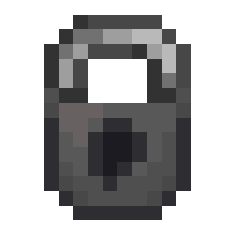

# Locky

[>> Downloads <<](https://github.com/boundarybreaker/Locky/releases)

*Accessible vanilla container locking*

**This mod is open source and under a permissive license.** As such, it can be included in any modpack on any platform without prior permission. We appreciate hearing about people using our mods, but you do not need to ask to use them. See the [LICENSE file](LICENSE) for more details.

Locky seeks to make the vanilla locking system usable for survival servers. To this end, it adds various features:
- Locks can be used to lock containers. Name the lock in an anvil, then shift-right-click it onto a container to lock it.
  - To open the container again, hold any item with the same name as the container's lock and right-click the container.
  - If the gamerule `locky:creativeLockBypass` is true (true by default), then players in creative mode will be able to open any locked container without a key.
- Lock picks can be used to remove container locks. Name the pick the same as the container's lock, then shift-right-click the container to remove the lock.
- If the gamerule `locky:protectLockedBlocks` is true (true by default), then any locked containers will, when broken, drop shulker-box style instead of spilling their contents.
- Name tags can be used to rename containers.

Any mod that adds containers which extend `LockableContainerBlockEntity` or a subclass of it will have automatic support. In the future, locks will be compatible with a component system for component-based block entities to implement.
